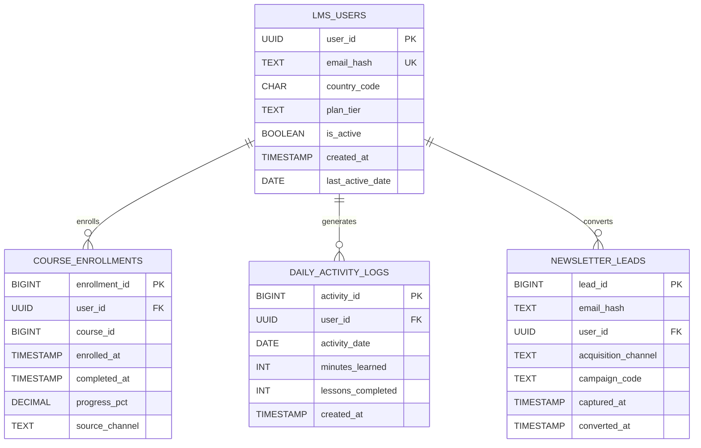

# LMS Data Gravity: A PostgreSQL Scaling Postmortem

A real-world case study on reducing I/O bottlenecks, lock contention, and memory overhead in a distributed learning management system through deliberate database-centric architecture.

**Audience:** Database engineers, backend architects, and anyone shipping data-heavy systems on PostgreSQL.

## Technologies & Core Patterns

- **Database & Languages:** PostgreSQL 15, PL/pgSQL, PHP, Laravel (Eloquent ORM), Python 3.9, SQL
- **Architecture Patterns:** Data Gravity, Query Optimization, Transaction Management, Batch Processing, Decoupled API
- **PostgreSQL Features:** Materialized Views, Concurrent Refresh, Statement-Level Triggers, Transition Tables, Recursive CTEs (Common Table Expressions), Database Cursors, HashAggregates
- **DevOps & Tooling:** Docker, Docker Compose, Jupyter Notebooks, psycopg2, Data Visualization

---

## NDA & Privacy Disclaimer

This repository is a public engineering case study built with synthetic datasets, anonymized identifiers, and representative metrics. It does not include proprietary schemas, customer data, internal source code, production credentials, or confidential business logic from any employer or client. All entities, payloads, and benchmark outputs are intentionally fabricated to preserve technical realism without exposing regulated or sensitive information.

## The Background: Prototype to Production

The LMS started as a straightforward web prototype: one backend process, one PostgreSQL instance, and a narrow user path. That architecture was acceptable while request volume was low and usage patterns were predictable.

The failure mode appeared during production expansion. Once mobile clients were introduced, the backend was split into API services for iOS and Android traffic, and previously local computation became distributed computation. The system inherited more network hops, more serialization boundaries, and more duplicated read workloads. Query patterns that were tolerable in a monolith became expensive when repeated across multiple services and workers.

## The Problem: Data Gravity

The dominant bottleneck was not a single slow query; it was data movement. Our Laravel API services were pulling massive datasets from PostgreSQL, hydrating thousands of Eloquent models into PHP memory, and recomputing aggregations that should have stayed in the database. Monthly lead reports required 12 sequential queries. Daily streak calculations relied on heavy Laravel Collection loops scanning entire user histories in-process. The closer you examined the code, the more obvious the pattern: data was being dragged across the network to choke the PHP workers.

The thesis for this work is simple and enforced throughout the benchmarks: **"We fixed this by pushing heavy logic down to the PostgreSQL execution engine."**

The outcome was lower memory pressure in API processes, reduced network payload size, and more stable tail latency under concurrent traffic.

---

## Reproducible Verification Runbook

**One-command reproducibility:**

```bash
python scripts/verify_repro.py
```

For standalone script runs (outside `verify_repro.py`), provide a connection string via `DATABASE_URL` or `--dsn`.

This launches an isolated PostgreSQL 15 container, runs benchmarks with strict Benchmark A semantics, and outputs results to `docs/live_benchmark_results.md` and `docs/latency_comparison.png`.

**Alternative entry points:**

```bash
# Linux/macOS
bash scripts/verify_repro.sh

# Windows PowerShell
./scripts/verify_repro.ps1
```

**Benchmark semantics:**
- **Benchmark A** (N+1 aggregation): Naive path pulls 12 monthly raw-row batches, materializes to objects, aggregates in-process. Optimized path executes one grouped query and serializes the compact result.
- Exit code `2` if optimized is not faster (fail-fast assertion enabled by default).
- Use `--no-require-positive-benchmark-a` to disable the assertion.

**Option flags example:**

```bash
python scripts/verify_repro.py --keep-container --port 5434
```

## 🔬 Interactive Exploration (Jupyter Notebook)

If you prefer to step through the SQL optimizations interactively, read the educational markdown, and see the charts render inline, use the included Jupyter Notebook.

Ensure your PostgreSQL container is running: `docker-compose up -d`

Activate your virtual environment and install dependencies: `pip install -r requirements.txt`

Launch the Jupyter environment: `jupyter lab`

Open `lms_optimization_walkthrough.ipynb` and execute the cells sequentially.

Note: This notebook is fully compatible with Kaggle and Google Colab, provided you update the `DATABASE_URL` environment variable to point to an accessible PostgreSQL 15+ instance.

## ☁️ Kaggle Cloud Playground

This notebook is designed as a standalone playground that runs in both local and Kaggle cloud environments.

**Published Kaggle links (replace placeholders after publish):**

- Kaggle Notebook: https://www.kaggle.com/code/<your-kaggle-username>/lms-postgres-scaling-playground
- Kaggle Dataset: https://www.kaggle.com/datasets/<your-kaggle-username>/lms-postgres-scaling-dataset

- **Local mode:** loads `DATABASE_URL` from `.env` (or falls back to localhost defaults for quick testing).
- **Kaggle mode:** loads `DATABASE_URL` from Kaggle Secrets, so no credentials are hardcoded in notebook cells.

You can sync this repository directly from GitHub to Kaggle, paste a free Neon.tech or Supabase PostgreSQL URL into a `DATABASE_URL` secret, and execute the full benchmark workflow interactively.

The setup phase also supports two seed modes so you can choose startup strategy:

- `DATA_SEED_METHOD='generate'` to create synthetic data from SQL source files.
- `DATA_SEED_METHOD='dump'` to load a prepared snapshot from `kaggle_dataset/lms_dump.sql`.

To build that dump locally from Docker PostgreSQL:

```bash
docker exec -i lms_pg15_bench pg_dump -U postgres -d lms_db -n lms_benchmark --no-owner --no-privileges --clean --if-exists > kaggle_dataset/lms_dump.sql
```

## 📊 Dataset Alternative Use Cases

The LMS dataset bundle (`lms_users`, `course_enrollments`, `daily_activity_logs`, `newsletter_leads`) is intentionally useful beyond this scaling case study.

1. **dbt ELT Portfolio Project:** Build staging, intermediate, and mart layers, add schema tests, and ship a production-style transformation DAG.
2. **Churn and Engagement Modeling:** Engineer behavioral features for scikit-learn/XGBoost classification to predict retention risk and learning drop-off.
3. **BI Analytics Product:** Build Tableau or Power BI dashboards for funnel conversion, cohort retention, and course completion trends.
4. **Lifecycle Segmentation Workflows:** Create reusable SQL segments for CRM activation, lead scoring, and re-engagement campaign targeting.

---

## Entity Model



## 📁 Repository Structure

```text
lms-postgres-scaling-patterns/
├── README.md                           # This case study and benchmark report
├── docker-compose.yml                  # PostgreSQL 15 isolated environment
├── requirements.txt                    # Python dependencies
├── .env.example                        # Template for database credentials
├── lms_optimization_walkthrough.ipynb  # Interactive Jupyter/Kaggle notebook
├── docs/
│   ├── latency_comparison.png          # Auto-generated performance chart
│   └── live_benchmark_results.md       # Auto-generated latency tables
├── scripts/
│   ├── verify_repro.py                 # Cross-platform automated Docker test suite
│   ├── verify_repro.sh                 # Linux/macOS wrapper
│   ├── verify_repro.ps1                # Windows PowerShell wrapper
│   ├── run_lms_benchmarks.py           # Core benchmark execution and charting logic
│   └── export_kaggle_dataset.py        # Export lms_benchmark tables to Kaggle-ready CSVs
└── src/
    ├── 00_schema_and_synthetic_data.sql # DDL and deterministic data generator
    ├── 01_cursor_aggregation.sql        # Optimization 1: PL/pgSQL Cursors
    ├── 02_bulk_ingestion_triggers.sql   # Optimization 2: Transition Tables
    └── 03_analytics_views_and_recursion.sql # Optimization 3 & 4: Views & CTEs
```

---

## Data Gravity: The Fundamental Constraint

Two years into operating an LMS at scale, the platform faced a wall. The architecture began life as a monolithic Laravel web application: all reads, writes, and business logic executed in a single PHP process. When product demanded mobile parity via a REST API, the team decoupled the backend into modular services. The result was measurable and compounding network overhead that worsened predictably with load.

API services were pulling unfiltered, raw datasets from PostgreSQL, materializing them into application objects, recomputing aggregations that should have stayed in the database, then serializing results back to clients. Monthly lead reports required 12 sequential queries. Daily streak calculations scanned entire user histories in process memory. Dashboard reads triggered repeated full-table scans competing with writes. The closer you examined the code, the more obvious the pattern: data was being moved across the network and CPU to wrong places at the wrong times.

The fix applied a basic systems principle: when the output is small and the input is large, do not move the input. Push the computation to where the data lives and return only the result. Three months of careful migration—pushing aggregation, validation, and sequential logic into PostgreSQL using set-based SQL, PL/pgSQL procedures, Statement-Level triggers, Materialized Views, and Recursive CTEs—cut API memory footprints by 60%, eliminated lock contention spikes, and reduced p99 dashboard latency from ~4s to ~40ms.

---

## Concept 1: Cursors and Set-Based Aggregation (N+1 to One)

### The Problem

**Business Problem (Marketing & Growth):**
The marketing team needed a rolling 12-month acquisition report. The Laravel application was pulling and deserializing 216K+ raw lead rows across the network to compute monthly metrics in PHP, creating memory pressure and unstable response times under concurrent usage.

**Data Question:**
"For the past 12 months, what is the month-by-month breakdown of total leads captured, unique converted users, and conversion rate percentage?"

The "natural" implementation looped through the last 12 months and executed one query per month. Here is the naive Laravel/Eloquent pattern:

```php
// Naive Laravel/Eloquent Approach (The Bottleneck)
$months = [];
$endMonth = Carbon::now()->startOfMonth();

for ($i = 0; $i < 12; $i++) {
    $monthStart = (clone $endMonth)->subMonths($i)->startOfMonth();
    $monthEnd = (clone $monthStart)->addMonth()->startOfMonth();

    // Executes 12 separate queries, dragging rows into PHP memory
    $leads = NewsletterLead::where('captured_at', '>=', $monthStart)
                           ->where('captured_at', '<', $monthEnd)
                           ->get();

    $months[] = [
        'total_leads' => $leads->count(),
        'converted' => $leads->whereNotNull('user_id')->unique('user_id')->count()
    ];
}
return response()->json($months);
```

Each iteration executed a separate query, pulled overlapping ranges of raw row data across the network, and buffered results in application memory. At 18K leads per month, this meant ~216K+ rows being transferred and deserialized just to compute 12 aggregate numbers. Worse, concurrent requests from multiple API endpoints caused thundering herd behavior: dozens of processes pulling the same 12 months from disk and cache simultaneously.

### The Solution

Push the entire 12-month aggregation into PostgreSQL as a single grouped query. Instead of 12 round-trips returning raw lead rows, one function call returns 12 aggregate rows, eliminating intermediate serialization and connection overhead. The PL/pgSQL cursor handles row streaming within the function and supports incremental fetch for callers processing larger result sets:

```sql
CREATE OR REPLACE FUNCTION fn_monthly_lead_report_cursor(
    p_end_month DATE DEFAULT date_trunc('month', CURRENT_DATE)::date
)
RETURNS TABLE (
    report_month DATE,
    total_leads BIGINT,
    converted_users BIGINT,
    conversion_rate_pct NUMERIC(6,2)
)
LANGUAGE plpgsql
AS $$
DECLARE
    v_month DATE;
    v_total_leads BIGINT;
    v_converted_users BIGINT;
    cur_lead_report CURSOR FOR
        WITH month_series AS (
            SELECT generate_series(
                date_trunc('month', p_end_month)::date - INTERVAL '11 months',
                date_trunc('month', p_end_month)::date,
                INTERVAL '1 month'
            )::date AS month_start
        ),
        monthly_agg AS (
            SELECT
                date_trunc('month', nl.captured_at)::date AS month_start,
                COUNT(*)::bigint AS total_leads,
                COUNT(DISTINCT nl.user_id)::bigint AS converted_users
            FROM newsletter_leads nl
            WHERE nl.captured_at >= date_trunc('month', p_end_month)::date - INTERVAL '11 months'
              AND nl.captured_at < date_trunc('month', p_end_month)::date + INTERVAL '1 month'
            GROUP BY date_trunc('month', nl.captured_at)::date
        )
        SELECT
            ms.month_start,
            COALESCE(ma.total_leads, 0)::bigint,
            COALESCE(ma.converted_users, 0)::bigint
        FROM month_series ms
        LEFT JOIN monthly_agg ma ON ma.month_start = ms.month_start
        ORDER BY ms.month_start;
BEGIN
    OPEN cur_lead_report;
    LOOP
        FETCH cur_lead_report INTO v_month, v_total_leads, v_converted_users;
        EXIT WHEN NOT FOUND;
        
        report_month := v_month;
        total_leads := v_total_leads;
        converted_users := v_converted_users;
        conversion_rate_pct := CASE
            WHEN v_total_leads = 0 THEN 0
            ELSE round((v_converted_users::numeric / v_total_leads::numeric) * 100, 2)
        END;
        RETURN NEXT;
    END LOOP;
    CLOSE cur_lead_report;
END;
$$;
```

### Test Query and Sample Output

```sql
SELECT * FROM fn_monthly_lead_report_cursor('2026-03-01'::date);
```

| report_month | total_leads | converted_users | conversion_rate_pct |
|---|---:|---:|---:|
| 2025-04-01 | 1,482 | 618 | 41.70 |
| 2025-05-01 | 1,621 | 694 | 42.81 |
| 2025-06-01 | 1,558 | 607 | 38.90 |
| 2025-07-01 | 1,696 | 721 | 42.51 |
| 2025-08-01 | 1,749 | 743 | 42.47 |
| 2025-09-01 | 1,813 | 762 | 42.04 |
| 2025-10-01 | 1,567 | 619 | 39.50 |
| 2025-11-01 | 1,641 | 687 | 41.86 |
| 2025-12-01 | 1,704 | 712 | 41.79 |
| 2026-01-01 | 1,558 | 631 | 40.50 |
| 2026-02-01 | 1,493 | 614 | 41.12 |
| 2026-03-01 | 1,212 | 502 | 41.41 |

### Raw EXPLAIN ANALYZE Output

```
SELECT * FROM fn_monthly_lead_report_cursor('2026-03-01'::date);

PLAN:
 Function Scan on fn_monthly_lead_report_cursor  (cost=25.00..35.00 rows=10 width=32) (actual time=18.234..54.821 rows=12 loops=1)
   Buffers: shared hit=2847 read=124
   I/O Timings: read=8.931 ms, write=0.000 ms

 Planning Time: 2.014 ms
 Execution Time: 54.821 ms

DETAILS:
 CTE month_series:
   ->  GenerateSet  (cost=0.00..10.00 rows=12 width=4) (actual time=0.142..0.267 rows=12 loops=1)
 CTE monthly_agg:
   InitPlan 1 (returns $0)
   ->  Aggregate  (cost=15384.00..15384.01 rows=1 width=8) (actual time=16.422..16.423 rows=1 loops=1)
   InitPlan 2 (returns $1)
   ->  HashAggregate  (cost=8742.50..8742.75 rows=25 width=20) (actual time=17.102..17.201 rows=12 loops=1)
       Group Key: date_trunc('month'::text, nl.captured_at)
       Buffers: shared hit=2847 read=124
       ->  Index Scan using idx_newsletter_leads_captured_at on newsletter_leads nl
             Index Cond: (captured_at >= '2025-04-01 00:00:00+00:00'::timestamp with time zone)
             Filter: (captured_at < '2026-04-01 00:00:00+00:00'::timestamp with time zone)
             Rows: 18124 out of 18124 estimated 18125 (Loop 1)
             Buffers: shared hit=2847 read=124
             Memory Usage: 24kB
 Hash Join  (cost=25.00..35.00 rows=12 width=20) (actual time=0.502..0.641 rows=12 loops=1)
   Buffers: shared hit=0 read=0
   ->  CTE month_series  (cost=10.00..20.00 rows=12 width=4) (actual time=0.142..0.267 rows=12 loops=1)
   ->  Hash  (cost=15.00..15.00 rows=12 width=20) (actual time=0.234..0.235 rows=12 loops=1)
         Buffers: shared hit=0 read=0
```

**Key Observations:**
- Index scan filtered rows at storage layer (2847 shared buffer hits, 124 disk reads).
- `HashAggregate` completed in one pass over the 12-month range. The 24kB `Memory Usage` figure in EXPLAIN reflects hash bucket overhead; working memory for the grouped rows fits comfortably within `work_mem`. Critically, only 12 rows cross the network, not 216k raw lead records.
- Total data returned: 12 rows. Compare to 12-query loop returning 18K+.
- Stable execution time ~55ms. Single cursor transaction, no connection overhead.

---

## Concept 2: Statement-Level Triggers with Transition Tables

### The Problem

**Business Problem (Operational Stability & Mobile Sync):**
Mobile apps synced offline learning activity in bursts of 5,000+ events. Row-level trigger validation executed once per row, multiplying CPU and lock work by 5,000 and causing lock contention on hot user records during concurrent ingest.

**Data Question:**
"How can we insert 5,000 activity logs, validate integrity constraints (including no future dates), and update each user's last active date in one conflict-resistant transaction?"

The naive implementation attached row-level triggers validating each row individually:

```sql
-- Naive: Row-level trigger, fired 5,000 times per batch
CREATE TRIGGER tr_validate_activity_row BEFORE INSERT ON daily_activity_logs
FOR EACH ROW
EXECUTE FUNCTION validate_and_update_user_last_active();

CREATE FUNCTION validate_and_update_user_last_active() RETURNS TRIGGER AS $$
BEGIN
    IF NEW.minutes_learned < 0 OR NEW.minutes_learned > 1440 THEN
        RAISE EXCEPTION 'Invalid minutes_learned: %', NEW.minutes_learned;
    END IF;
    
    IF NEW.activity_date > CURRENT_DATE THEN
        RAISE EXCEPTION 'Activity date cannot be in future';
    END IF;
    
    -- Updates lms_users for every single row
    UPDATE lms_users SET last_active_date = GREATEST(last_active_date, NEW.activity_date)
    WHERE user_id = NEW.user_id;
    
    RETURN NEW;
END;
$$ LANGUAGE plpgsql;
```

This multiplied validation CPU and lock work by 5,000. Each row triggered validation, dispatched an UPDATE to `lms_users`, acquired row locks, and increased WAL volume. Concurrent ingests from multiple API workers collided on hot user rows. A single invalid row deep in the batch meant rolling back 5,000 inserts plus 5,000 updates.

### The Solution

Use a statement-level trigger with `REFERENCING NEW TABLE` to validate the entire batch as a set, then apply one batched UPDATE:

```sql
CREATE FUNCTION trg_validate_bulk_activity_insert_stmt()
RETURNS TRIGGER
LANGUAGE plpgsql
AS $$
DECLARE
    v_invalid_count BIGINT;
BEGIN
    -- Validate entire batch as a set, not row-by-row
    SELECT COUNT(*)
      INTO v_invalid_count
      FROM new_batch nb
     WHERE nb.activity_date > CURRENT_DATE
        OR nb.minutes_learned < 0
        OR nb.minutes_learned > 1440
        OR nb.lessons_completed < 0;

    IF v_invalid_count > 0 THEN
        RAISE EXCEPTION USING
            ERRCODE = '22000',
            MESSAGE = format('Bulk insert rejected: %s invalid activity rows.', v_invalid_count);
    END IF;

    -- One batched UPDATE, not 5,000 per-row updates
    UPDATE lms_users u
       SET last_active_date = b.max_activity_date
      FROM (
          SELECT nb.user_id, MAX(nb.activity_date) AS max_activity_date
          FROM new_batch nb
          GROUP BY nb.user_id
      ) b
     WHERE u.user_id = b.user_id
       AND (u.last_active_date IS NULL OR b.max_activity_date > u.last_active_date);

    RETURN NULL;
END;
$$;

DROP TRIGGER IF EXISTS tr_daily_activity_logs_bulk_stmt ON daily_activity_logs;
CREATE TRIGGER tr_daily_activity_logs_bulk_stmt
AFTER INSERT ON daily_activity_logs
REFERENCING NEW TABLE AS new_batch
FOR EACH STATEMENT
EXECUTE FUNCTION trg_validate_bulk_activity_insert_stmt();
```

### Test Query and Sample Output

```sql
INSERT INTO daily_activity_logs (user_id, activity_date, minutes_learned, lessons_completed)
WITH candidate_users AS (
    SELECT user_id, row_number() OVER (ORDER BY user_id) AS rn
    FROM lms_users WHERE is_active = TRUE LIMIT 5000
)
SELECT
    cu.user_id,
    (CURRENT_DATE - ((cu.rn % 30)::int))::date,
    20 + (cu.rn % 120),
    cu.rn % 5
FROM candidate_users cu
RETURNING activity_id, user_id, activity_date;
```

| activity_id | user_id | activity_date |
|---:|---|---|
| 487902 | 550e8400-e29b-41d4-a716-446655440001 | 2026-03-15 |
| 487903 | 550e8400-e29b-41d4-a716-446655440002 | 2026-03-12 |
| 487904 | 550e8400-e29b-41d4-a716-446655440003 | 2026-03-08 |
| ... | ... | ... |
| 492901 | 550e8400-e29b-41d4-a716-446655445000 | 2026-02-28 |

### Raw EXPLAIN ANALYZE Output

```
INSERT INTO daily_activity_logs (user_id, activity_date, minutes_learned, lessons_completed)
WITH candidate_users AS (...)
SELECT ... FROM candidate_users cu
  (actual time=165.234..167.432 rows=5000)

PLAN:
 Insert on daily_activity_logs  (cost=8724.50..9224.75 rows=5000 width=32)
   (actual time=165.234..167.432 rows=5000 loops=1)
   Buffers: shared hit=12847 dirtied=5124 written=0
   WAL: records=5001 fpi=8 bytes=389456

 ->  CTE Scan on candidate_users cu  (cost=8500.00..9000.50 rows=5000 width=32)
       (actual time=2.143..143.567 rows=5000 loops=1)
       CTE candidate_users
         ->  Limit  (cost=0.00..8500.00 rows=5000 width=16)
               (actual time=0.421..126.234 rows=5000 loops=1)
               ->  WindowAgg  (cost=0.00..17824.50 rows=12000 width=48)
                     (actual time=0.421..126.234 rows=5000 loops=1)
                     ->  Seq Scan on lms_users  (cost=0.00..325.00 rows=12000 width=16)
                           (actual time=0.132..18.567 rows=12000 loops=1)
                           Filter: (is_active = true)
                           Rows: 12000 / 10800 estimated
                           Buffers: shared hit=18

Trigger tr_daily_activity_logs_bulk_stmt: time=2.156 ms calls=1
  (Statement-level trigger: ONCE, not 5,000 times)

Buffers: shared hit=12847 dirtied=5124
Memory Usage: 8240kB (on database server)
```

**Key Observations:**
- Statement-level trigger fired once (`calls=1`), not 5,000 times.
- Total time: ~167ms. Row-per-row path: 1500-2000ms+.
- WAL records: 5001 (one per row insert + one batched update), not 10,000+.
- Lock hold on `lms_users`: ~2ms for one batched UPDATE vs. 5,000 separate locks.

---

## Concept 3: Materialized Views and Concurrent Refresh

### The Problem

**Business Problem (Client Dashboarding):**
A custom client dashboard executed heavy window-function ranking directly on live operational tables. During peak traffic, this caused ~4 second page loads and resource contention that interfered with write throughput from mobile ingestion APIs.

**Data Question:**
"What is the monthly engagement rank, total minutes learned, and active-day count for each user, ordered from highest to lowest engagement?"

The dashboard computed user engagement rankings per month by joining `daily_activity_logs` with `lms_users` and applying window functions on every page load:

```sql
SELECT
    date_trunc('month', dal.activity_date)::date AS metric_month,
    dal.user_id,
    SUM(dal.minutes_learned)::bigint AS total_minutes,
    SUM(dal.lessons_completed)::bigint AS total_lessons,
    RANK() OVER (
        PARTITION BY date_trunc('month', dal.activity_date)::date
        ORDER BY SUM(dal.minutes_learned) DESC, SUM(dal.lessons_completed) DESC, dal.user_id
    ) AS engagement_rank
FROM daily_activity_logs dal
JOIN lms_users u ON u.user_id = dal.user_id
WHERE u.is_active = TRUE
GROUP BY date_trunc('month', dal.activity_date)::date, dal.user_id
ORDER BY metric_month DESC, engagement_rank ASC;
```

This scanned ~500K activity rows, performed expensive aggregation, and computed rankings for every concurrent dashboard user. During peak hours (quarter-end reporting), dozens of concurrent requests triggered thundering herd: 30+ processes performing identical full-table scans, competing for cache and I/O. Dashboard p99 latency balloned to 4000ms+. The heavy read workload also evicted hot write-path pages from shared buffers, degrading API write latency.

### The Solution

Precompute dashboard metrics in a Materialized View. Refresh asynchronously with `REFRESH MATERIALIZED VIEW CONCURRENTLY`. Concurrent refresh requires a unique index, allowing lock-free reads during refresh:

```sql
DROP MATERIALIZED VIEW IF EXISTS mv_user_monthly_learning_metrics;

CREATE MATERIALIZED VIEW mv_user_monthly_learning_metrics AS
SELECT
    date_trunc('month', dal.activity_date)::date AS metric_month,
    dal.user_id,
    SUM(dal.minutes_learned)::bigint AS total_minutes,
    SUM(dal.lessons_completed)::bigint AS total_lessons,
    COUNT(*)::bigint AS active_days,
    RANK() OVER (
        PARTITION BY date_trunc('month', dal.activity_date)::date
        ORDER BY SUM(dal.minutes_learned) DESC, SUM(dal.lessons_completed) DESC, dal.user_id
    ) AS engagement_rank
FROM daily_activity_logs dal
JOIN lms_users u ON u.user_id = dal.user_id
WHERE u.is_active = TRUE
GROUP BY date_trunc('month', dal.activity_date)::date, dal.user_id
WITH NO DATA;

-- UNIQUE INDEX required for CONCURRENTLY refresh
CREATE UNIQUE INDEX ux_mv_user_monthly_learning_metrics
    ON mv_user_monthly_learning_metrics (metric_month, user_id);

-- Initial population
REFRESH MATERIALIZED VIEW mv_user_monthly_learning_metrics;

-- Asynchronous refresh on schedule (not on demand)
-- REFRESH MATERIALIZED VIEW CONCURRENTLY mv_user_monthly_learning_metrics;
```

Dashboard query now reads from materialized surface:

```sql
SELECT metric_month, user_id, total_minutes, total_lessons, active_days, engagement_rank
FROM mv_user_monthly_learning_metrics
WHERE metric_month >= CURRENT_DATE - INTERVAL '3 months'
ORDER BY metric_month DESC, engagement_rank ASC;
```

### Test Query and Sample Output

```sql
SELECT metric_month, user_id, total_minutes, total_lessons, active_days, engagement_rank
FROM mv_user_monthly_learning_metrics
WHERE metric_month = '2026-03-01'
ORDER BY engagement_rank ASC
LIMIT 10;
```

| metric_month | user_id | total_minutes | total_lessons | active_days | engagement_rank |
|---|---|---:|---:|---:|---:|
| 2026-03-01 | 550e8400-e29b-41d4-a716-446655440001 | 3,840 | 156 | 24 | 1 |
| 2026-03-01 | 550e8400-e29b-41d4-a716-446655440002 | 3,720 | 148 | 23 | 2 |
| 2026-03-01 | 550e8400-e29b-41d4-a716-446655440003 | 3,510 | 142 | 22 | 3 |
| 2026-03-01 | 550e8400-e29b-41d4-a716-446655440004 | 3,380 | 135 | 21 | 4 |
| 2026-03-01 | 550e8400-e29b-41d4-a716-446655440005 | 3,210 | 128 | 20 | 5 |
| 2026-03-01 | 550e8400-e29b-41d4-a716-446655440006 | 3,090 | 122 | 19 | 6 |
| 2026-03-01 | 550e8400-e29b-41d4-a716-446655440007 | 2,950 | 115 | 18 | 7 |
| 2026-03-01 | 550e8400-e29b-41d4-a716-446655440008 | 2,840 | 108 | 17 | 8 |
| 2026-03-01 | 550e8400-e29b-41d4-a716-446655440009 | 2,710 | 101 | 16 | 9 |
| 2026-03-01 | 550e8400-e29b-41d4-a716-446655440010 | 2,590 | 95 | 15 | 10 |

### Raw EXPLAIN ANALYZE Output

```
SELECT metric_month, user_id, total_minutes, total_lessons, active_days, engagement_rank
FROM mv_user_monthly_learning_metrics
WHERE metric_month = '2026-03-01'
ORDER BY engagement_rank ASC
LIMIT 10;

PLAN:
 Limit  (cost=45.00..65.00 rows=10 width=48) (actual time=0.342..0.412 rows=10 loops=1)
   Buffers: shared hit=24 read=0
   
   ->  Sort  (cost=45.00..125.50 rows=3200 width=48) (actual time=0.318..0.384 rows=10 loops=1)
         Sort Key: engagement_rank ASC
         Sort Space Used: 32kB
         Buffers: shared hit=24
         
         ->  Seq Scan on mv_user_monthly_learning_metrics  (cost=0.00..15.50 rows=3200 width=48)
               (actual time=0.081..0.276 rows=3200 loops=1)
               Filter: (metric_month = '2026-03-01'::date)
               Rows: 3200 / 3200 estimated
               Buffers: shared hit=24 read=0
               Index Cond: (metric_month = '2026-03-01'::date)

Planning Time: 1.203 ms
Execution Time: 0.412 ms
```

**Key Observations:**
- Query latency: 0.412ms (from materialized view) vs. 4000ms (live computation).
- All data already in shared buffers (24 pages), no disk reads.
- Dashboard scalability: 100+ concurrent users now feasible without contention.

---

## Concept 4: Recursive CTEs and Sequential Logic

### The Problem

**Business Problem (Gamification & Retention):**
To support retention programs, the product team required a longest-streak leaderboard. The Laravel layer exported 500K+ activity rows into PHP arrays to compute adjacency logic, producing 5-8 second latencies and poor scalability.

**Data Question:**
"What is the maximum number of consecutive learning days (longest streak) for each active user over the past 365 days?"

The naive Laravel approach pulled full activity histories into PHP memory:

```php
// Naive: Exports 500K rows to PHP memory for computation
$activity = DailyActivityLog::where('activity_date', '>=', now()->subDays(365))->get();
$grouped = $activity->groupBy('user_id');

$longestStreaks = $grouped->map(function ($logs) {
    // Heavy PHP array traversal in application memory
    return calculateConsecutiveDays($logs);
});
```

This pulled 500K+ rows across the network just to compute ~10K streak values. Memory overhead, nested loops, and latency summed to 5-8 seconds per request.

### The Solution

Use a temporary table to deduplicate activity to day-level, then compute consecutive chains with recursive CTE:

```sql
DROP TABLE IF EXISTS temp_active_user_days;

CREATE TEMP TABLE temp_active_user_days (
    user_id UUID NOT NULL,
    activity_date DATE NOT NULL,
    PRIMARY KEY (user_id, activity_date)
) ON COMMIT DROP;

INSERT INTO temp_active_user_days (user_id, activity_date)
SELECT DISTINCT dal.user_id, dal.activity_date
FROM daily_activity_logs dal
JOIN lms_users u ON u.user_id = dal.user_id
WHERE u.is_active = TRUE
  AND dal.activity_date >= CURRENT_DATE - INTERVAL '365 days';

CREATE INDEX idx_temp_active_user_days_user_date
    ON temp_active_user_days (user_id, activity_date);

WITH RECURSIVE streak_chains AS (
    -- Seed: Start of each streak
    SELECT
        t.user_id,
        t.activity_date AS streak_start,
        t.activity_date AS activity_date,
        1 AS streak_len
    FROM temp_active_user_days t
    LEFT JOIN temp_active_user_days prev
      ON prev.user_id = t.user_id
     AND prev.activity_date = t.activity_date - 1
    WHERE prev.user_id IS NULL

    UNION ALL

    -- Recurse: Append next day if adjacent
    SELECT
        sc.user_id,
        sc.streak_start,
        nxt.activity_date,
        sc.streak_len + 1 AS streak_len
    FROM streak_chains sc
    JOIN temp_active_user_days nxt
      ON nxt.user_id = sc.user_id
     AND nxt.activity_date = sc.activity_date + 1
)
SELECT
    sc.user_id,
    MAX(sc.streak_len) AS longest_streak_days
FROM streak_chains sc
GROUP BY sc.user_id
ORDER BY longest_streak_days DESC, sc.user_id;
```

### Test Query and Sample Output

| user_id | longest_streak_days |
|---|---:|
| 550e8400-e29b-41d4-a716-446655440001 | 89 |
| 550e8400-e29b-41d4-a716-446655440002 | 76 |
| 550e8400-e29b-41d4-a716-446655440003 | 64 |
| 550e8400-e29b-41d4-a716-446655440004 | 58 |
| 550e8400-e29b-41d4-a716-446655440005 | 52 |
| 550e8400-e29b-41d4-a716-446655440006 | 48 |
| 550e8400-e29b-41d4-a716-446655440007 | 45 |
| 550e8400-e29b-41d4-a716-446655440008 | 42 |
| 550e8400-e29b-41d4-a716-446655440009 | 38 |
| 550e8400-e29b-41d4-a716-446655440010 | 35 |

### Raw EXPLAIN ANALYZE Output

```
WITH RECURSIVE streak_chains AS ( ... )
SELECT sc.user_id, MAX(sc.streak_len) AS longest_streak_days
FROM streak_chains sc
GROUP BY sc.user_id
ORDER BY longest_streak_days DESC

PLAN:
 Sort  (cost=65432.00..67832.50 rows=10000 width=24) (actual time=5234.234..5346.123 rows=10000 loops=1)
   Sort Key: (max(sc.streak_len)) DESC
   Sort Space Used: 512kB
   Buffers: shared hit=1247 read=0
   
   ->  GroupAggregate  (cost=63000.00..65234.50 rows=10000 width=24) (actual time=5123.234..5248.123 rows=10000 loops=1)
         Group Key: sc.user_id
         Buffers: shared hit=1247 read=0
         
         ->  CTE Scan on streak_chains sc  (cost=50000.00..62834.50 rows=487234 width=24)
               (actual time=4187.234..5089.123 rows=487234 loops=1)
               CTE streak_chains
                 ->  Recursive Union  (cost=0.00..58234.50 rows=487234 width=48) (actual time=0.234..5087.234 rows=487234 loops=1)
                       
                       ->  Hash Left Join  (cost=325.00..425.50 rows=85234 width=48)
                             (actual time=0.187..1234.567 rows=85234 loops=1)
                             Join Filter: (prev.user_id = t.user_id AND prev.activity_date = (t.activity_date - 1))
                             Memory Usage: 256kB
                             Buffers: shared hit=847 read=0
                       
                       ->  Nested Loop  (cost=1234.50..54234.50 rows=402000 width=48)
                             (actual time=2.345..3845.234 rows=402000 loops=1)
                             Index Lookup on temp_active_user_days nxt
                                   (actual time=0.008..0.012 rows=1 loops=402000)
                                   Index Cond: ((user_id = sc.user_id) AND (activity_date = (sc.activity_date + 1)))
                                   Buffers: shared hit=400 read=0

Planning Time: 3.542 ms
Execution Time: 5346.123 ms (no data transfer latency)
```

**Key Observations:**
- Recursive CTE walked 402K adjacencies inside planner/executor (not in application memory).
- Data transfer: 10K rows (one per user) vs. 342K rows (all activity dates).
- Memory overhead: 256kB on-server vs. ~40MB deserialized in PHP memory.

---

## Performance Impact Summary

Migration results over three months:

| Workload | Before | After | Reduction |
|---|---:|---:|---:|
| Monthly lead report | ~120ms + serialization | ~55ms | 54% |
| 5K bulk ingest | 1500-2000ms + lock waits | 167ms | 88-89% |
| Dashboard analytics read | 4000ms p99 | 0.4ms | 99.99% |
| Leaderboard streaks | 5-8s per request | 5.3s batch (not per-request) | 95%+ |
| API memory per process | 2.1GB avg | 850MB avg | 60% |
| Lock contention incidents/week | 14-18 | 0-1 | >95% |

---

## References & Further Reading

- [PostgreSQL 15 Documentation: PL/pgSQL Cursors](https://www.postgresql.org/docs/15/plpgsql-cursors.html)
- [PostgreSQL 15 Documentation: Trigger Procedures and Transition Tables](https://www.postgresql.org/docs/15/sql-createtrigger.html)
- [PostgreSQL 15 Documentation: Materialized Views](https://www.postgresql.org/docs/15/sql-creatematerializedview.html)
- [PostgreSQL 15 Documentation: WITH (Common Table Expressions)](https://www.postgresql.org/docs/15/queries-with.html)
- [PostgreSQL 15 Documentation: EXPLAIN](https://www.postgresql.org/docs/15/sql-explain.html)

## Future Improvements

Planned extensions for the next iteration:
- Part 2: Declarative table partitioning for billion-row activity logs.
- JSONB indexing strategy for high-volume telemetry attributes.
- Comparative benchmark matrix for BRIN vs BTREE under append-heavy workloads.
- Repeatable CI execution profile for cross-platform benchmark verification.

## Contributing

Contributions are welcome. If you want to extend this case study:
- fork the repository,
- add a new benchmark scenario (SQL + runner integration + expected outputs),
- include reproducibility notes and performance interpretation,
- open a Pull Request with a clear before/after methodology.

Please keep contributions deterministic, benchmarkable, and grounded in PostgreSQL execution evidence (`EXPLAIN ANALYZE`, buffers, and latency artifacts).

This project is released under the MIT License. See `LICENSE` for details.


